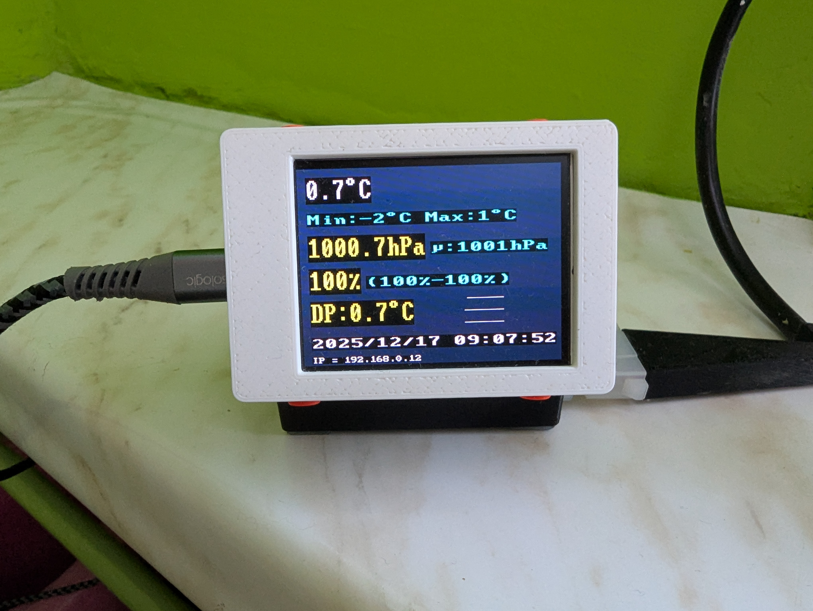

# Pico Weather Station 🌦️
**Version:** 1.0.1 
**Status:** Stable

A compact weather station based on the **Raspberry Pi Pico W**, **BME280 sensor**
and **Waveshare Pico LCD 2"** display.

The project measures environmental data, displays it locally on an LCD,
logs measurements and provides a lightweight HTML status page over Wi-Fi.

---

## Features
- Temperature, humidity and pressure measurements
- Daily min/max statistics
- Real-time data display on LCD
- Lightweight built-in HTML server
- Data logging

---

## Hardware Requirements
- Raspberry Pi Pico W
- BME280 sensor (I2C)
- Waveshare Pico LCD 2"  
  https://www.waveshare.com/wiki/Pico-LCD-2
- MicroPython firmware

---

## Project Structure
A detailed description of the repository structure can be found in  
[`structure.md`](structure.md).

---

## Getting Started

1. Flash **MicroPython** onto the Raspberry Pi Pico W
2. Copy `src/secrets.py.example` to `src/secrets.py` and enter your Wi-Fi credentials
3. Upload all files from the `src/` directory to the Pico W
4. Reset the board

After booting, the LCD should display:
- current temperature
- daily min/max temperature
- pressure and average pressure
- humidity and humidity range
- dew point temperature
- date and time
- device IP address

---

## Enclosure
3D-printable STL files for the enclosure are available in:
hardware/enclosure/

Assembly instructions can be found in the corresponding README file.

---

## Buttons
Hold for 1 second to operate.
- Top Left - Brightness
- Bottom Right - WiFi Reset
- Top Right - Reset
- Bottom Left - No Function
  
---

## Photos

---

## License
This project is licensed under the **MIT License**.

